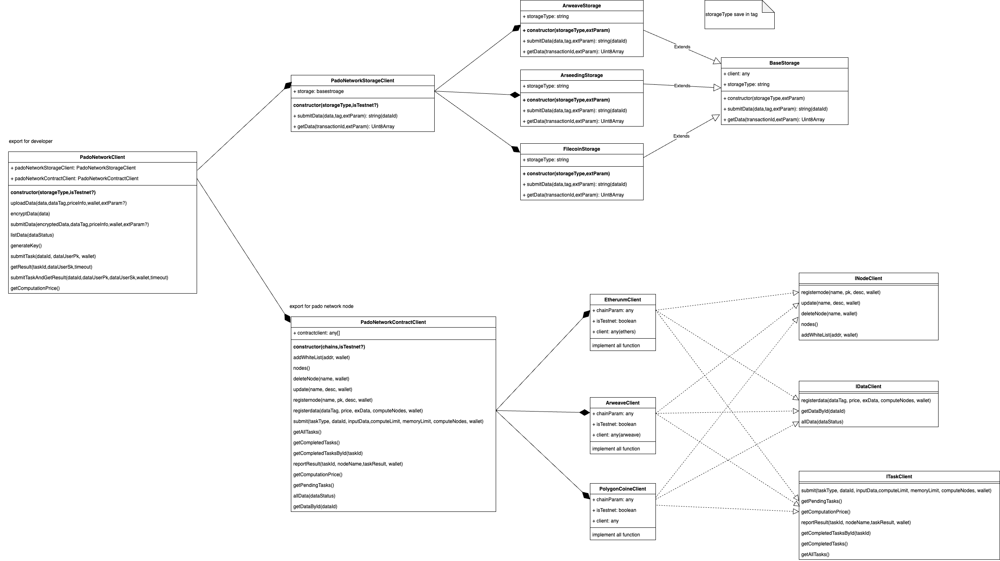

# pado-ao-sdk


## Overview

This is PADO AO SDK of PADO Network for dapps developer. PADO Network consists of three parts, the other two parts are:

- [PADO AO Processes](https://github.com/pado-labs/pado-ao-process)
- [PADO Nodes](https://github.com/pado-labs/pado-network)


## Features

- **Upload Data**

Data Provider can upload encrypted data through dapp developed based on PADO SDK and set data prices at the same time. The data encrypted by the FHE algorithm and the PADO Node public key will be uploaded to Arweave, and the data information will be registered to AO's Data Registry Process.

- **Submit Task**

Data User submits computation tasks with Data User Public Key through the dapp developed based on PADO SDK, and pays a certain computation and data fee. The computation tasks will be submitted to AO's Task Process.

- **Get Data**

Data User obtains encrypted data from Arweave, obtains task results and data information from Process, and then uses the FHE algorithm and Data User Public Key in the SDK to decrypt the results.

## Quick Start

- [demos](./src/demo/README.md).

## Install

### Nodejs

```shell
npm install --save @padolabs/pado-ao-sdk
```

### Browser

* Install sdk
  ```shell
  npm install --save @padolabs/pado-ao-sdk
  ```

* Introduce lhe.js into the html file, for example:

  ```html
    <script type="text/javascript" src="https://pado-online.s3.ap-northeast-1.amazonaws.com/resources/lhe.js"></script>
  ```

* If you meet the following error in your browser's console:
```shell
_stream_writable.js:57 Uncaught ReferenceError: process is not defined
    at node_modules/readable-stream/lib/_stream_writable.js (_stream_writable.js:57:18)
    at __require2 (chunk-BYPFWIQ6.js?v=4d6312bd:19:50)
```
You can refer to project using vite. [link](https://github.com/pado-labs/pado-ao-demo/blob/main/vite.config.ts)

  


## API


### PadoNetworkClient
#### constructor
The constructor of PadoNetworkClient.

* **Parameters:**
  * `storageType:String`  The storage type, currently supports `arweave` and `arseeding`.
  * `isTestnet: Boolean` whether is testnet.
* **Returns:**

* **Example:**
```typescript
import {padonetwork} from "@padolabs/pado-ao-sdk/";

const padoNetworkClient = new padonetwork.PadoNetworkClient('arweave', true);
```


#### uploadData

Encrypt data and upload encrypted data to AR. The combination of [encryptData](#encryptData) and [submitData](#submitData).

* **Parameters:**
  * `data:Uint8Array` Plain data need to encrypt and upload.
  * `dataTag:CommonObject` The data meta info object.
  * `priceInfo:PriceInfo` The data price symbol(symbol is optional, default is AOCRED) and price. Currently only AO's test token AOCRED is supported, with a minimum price unit of 1 (1 means 0.001 AOCRED).
  * `wallet:any` The  wallet  object, this wallet must have enough Token.
  * `extParam(optional)`  The extParam object, which can be used to pass additional parameters to the upload process.Usage can in the following example. By default, we use AR native transaction/data.
* **Returns:**

  * `Promise<string>` The uploaded encrypted data id.

* **Example:**

  ```typescript
  import { readFileSync } from "node:fs";
  import {padonetwork} from "@padolabs/pado-ao-sdk/";

  const padoNetworkClient = new padonetwork.PadoNetworkClient('arweave', true);
 
  
  const extParam = {
    uploadParam: {
      //sotreageType: arweave or arseeding, default is arweave
      storageType: 'arseeding', 
      //symbolTag:The tag corresponding to the token used for payment. ref: https://web3infra.dev/docs/arseeding/sdk/arseeding-js/getTokenTag
      symbolTag: 'arweave,ethereum-ar-AAAAAAAAAAAAAAAAAAAAAAAAAAAAAAAAAAAAAAAAAAA,0x4fadc7a98f2dc96510e42dd1a74141eeae0c1543'
    }
  }
  const wallet = JSON.parse(readFileSync(walletpath).toString());
  let data = new Uint8Array([1, 2, 3, 4, 5, 6, 7, 8]);
  let dataTag = { "testtagkey": "testtagvalue" };
  let priceInfo = { price: "1", symbol: "AOCRED" };
  const dataId = await padoNetworkClient.uploadData(data, dataTag, priceInfo, wallet ,extParam);
  console.log(`DATAID=${dataId}`);
  ```


#### encryptData

Encrypt data.

* **Parameters:**

  * `data:Uint8Array` Plain data need to encrypt.

* **Returns:**

  * `Promise<CommonObject>` The encrypted data.

* **Example:**

  ```typescript
  import {padonetwork} from "@padolabs/pado-ao-sdk/";
  const padoNetworkClient = new padonetwork.PadoNetworkClient('arweave', true);

  let data = new Uint8Array([1, 2, 3, 4, 5, 6, 7, 8]);
  const encryptedData = await padoNetworkClient.encryptData(data);
  console.log(`encryptedData=${encryptedData}`);
  ```


#### submitData

Submit encrypted data to storage server.

* **Parameters:**

  * `encryptedData:CommonObject` Encrypted data need to upload. The value is returned by encryptData.
  * `dataTag:CommonObject` The data meta info object.
  * `priceInfo:PriceInfo` The data price symbol(symbol is optional, default is AOCRED) and price. Currently only AO's test token AOCRED is supported, with a minimum price unit of 1 (1 means 0.001 AOCRED).
  * `wallet:any` The  wallet  object, this wallet must have enough Token.
  * `extParam(optional)`  The extParam object, which can be used to pass additional parameters to the upload process.Usage can in the following example. By default, we use AR native transaction/data.

* **Returns:**

  * `Promise<string>` The uploaded encrypted data id.

* **Example:**

  ```typescript
  import { readFileSync } from "node:fs";
  import {padonetwork} from "@padolabs/pado-ao-sdk/";

  const padoNetworkClient = new padonetwork.PadoNetworkClient('arweave', true);
 
  
  
  const extParam = {
    uploadParam: {
      //sotreageType: arweave or arseeding, default is arweave
      storageType: 'arseeding', 
      //symbolTag:The tag corresponding to the token used for payment. ref: https://web3infra.dev/docs/arseeding/sdk/arseeding-js/getTokenTag
      symbolTag: 'arweave,ethereum-ar-AAAAAAAAAAAAAAAAAAAAAAAAAAAAAAAAAAAAAAAAAAA,0x4fadc7a98f2dc96510e42dd1a74141eeae0c1543'
    }
  }
  const wallet = JSON.parse(readFileSync(walletpath).toString());
  let data = new Uint8Array([1, 2, 3, 4, 5, 6, 7, 8]);
  let dataTag = { "testtagkey": "testtagvalue" };
  let priceInfo = { price: "1", symbol: "AOCRED" };
  const encryptedData = await encryptData(data);
  const dataId = await padoNetworkClient.submitData(encryptedData, dataTag, priceInfo, wallet ,extParam);
  console.log(`DATAID=${dataId}`);
  ```
#### listData
Lists all data in the specified state, default status is `Valid`

* **Parameters:**

  * `dataStatus:string` The status of data. support status: `Valid`, `Invalid`and `All`. Default is `Valid`.

* **Returns:**

  * `Promise<DataItems>` Data lists.

* **Example:**

```typescript
  import {padonetwork} from "@padolabs/pado-ao-sdk/";

  const padoNetworkClient = new padonetwork.PadoNetworkClient('arweave', true);
  const dataItems = await padoNetworkClient.listData();

```

#### generateKey
Generate private and public key pair for submitTask and getResult.

* **Parameters:**


* **Returns:**

  * `Promise<KeyInfo>` Return the key pair object which contains pk and sk fields.

* **Example:**

```typescript
  import {padonetwork} from "@padolabs/pado-ao-sdk/";
  const padoNetworkClient = new padonetwork.PadoNetworkClient('arweave', true);
  const keyInfo = await padoNetworkClient.generateKey();
```

#### submitTask

Submit a task to PADO Network. And must pay the data fee corresponding to the dataId and the computing fee of the PADO Node. Now each task charges a certain amount of AOCRED(TestToken) per computing node,  and the [getComputationPrice](#getComputationPrice) can get the amount.

* **Parameters:**

  * `dataId:string` The data id.
  * `dataUserPk:string` The user's public key generated by keygen.
  * `wallet:any` The ar wallet json object, this wallet must have AOCRED(TestToken). Pass `window.arweaveWallet` in a browser.
* **Returns:**
  * `Promise<string>` The submited task id.

* **Example:**

  ```typescript
  import {padonetwork} from "@padolabs/pado-ao-sdk/";
  import { readFileSync } from "node:fs";
  const padoNetworkClient = new padonetwork.PadoNetworkClient('arweave', true);

  let key = await padoNetworkClient.generateKey();
  const wallet = JSON.parse(readFileSync(walletpath).toString());
  const taskId = await padoNetworkClient.submitTask(dataId, key.pk, wallet);
  console.log("taskId=", taskId);
  ```

#### getResult

Get the result of the task.

* **Parameters:**
  * `taskId:string` The task id.
  * `dataUserSk:string` The user's secret key generated by keygen.
  * `arweave:Arweave(optional)` Arweave object generated by arweave-js init method and default is AR production.
  * `timeout:number(optional)` Timeout in milliseconds (default: 10 seconds).
* **Returns:**
  * `Promise<Uint8Array>` Return plain data.

* **Example:**

  ```typescript
  import {padonetwork} from "@padolabs/pado-ao-sdk/";
  const padoNetworkClient = new padonetwork.PadoNetworkClient('arweave', true);  
  const data = await padoNetworkClient.getResult(taskId, key.sk, arweave);
  console.log(`data=${data}`);
  ```

#### submitTaskAndGetResult

Submit a task to AO and get the result. The combination of submitTask and getResult.

* **Parameters:**

  * `dataId:string` The data id.
  * `dataUserPk:string` The user's public key generated by keygen.
  * `dataUserSk:string` The user's secret key generated by keygen.
  * `wallet:any` The ar wallet json object, this wallet must have AOCRED(TestToken). Pass `window.arweaveWallet` in a browser.
  * `arweave:Arweave(optional)` Arweave object generated by arweave-js init method and default is AR production.
  * `timeout:number(optional)` Timeout in milliseconds (default: 10 seconds).
* **Returns:**
  * `Promise<Uint8Array>` Return plain data.

* **Example:**

  ```typescript
  import {padonetwork} from "@padolabs/pado-ao-sdk/";
  const padoNetworkClient = new padoNetworkClient.PadoNetworkClient('arweave', true);    
  const data = await padoNetworkClient.submitTaskAndGetResult(dataId, key.pk, key.sk, wallet, arweave)
  console.log(`data=${data}`);
  ```

#### getComputationPrice

Get the computing price of each node for each task. Now only supports AO’s test token AOCRED, minimum unit to use AOCRED(1 means 0.001 AOCRED).

* **Parameters:** NULL.

* **Returns:**

  * `Promise<string>` Return the computing price of a node.

* **Example:**

  ```typescript
  import {padonetwork} from "@padolabs/pado-ao-sdk/";
  const padoNetworkClient = new padonetwork.PadoNetworkClient('arweave', true);      
  const price = await padoNetworkClient.getComputationPrice();
  console.log("price=", price);
  ```


## Building

```sh
npm install
npm run build
```
